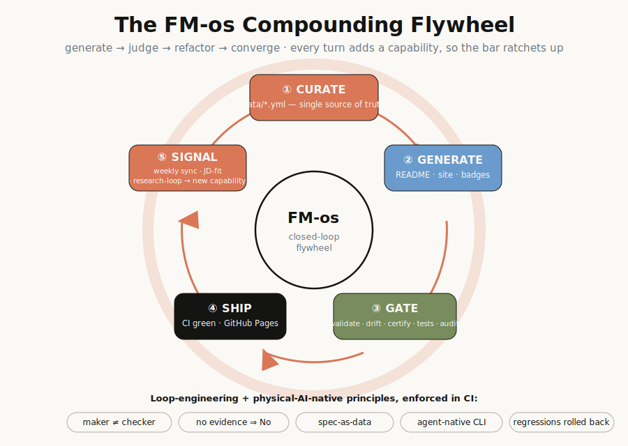

# 🛠️ FM-os — the Foundation Model Operating System

<div align="center">

[](https://awesome.re)
[](CONTRIBUTING.md)
[](https://github.com/wjlgatech/FM-os/stargazers)
[](https://github.com/wjlgatech/FM-os/graphs/contributors)
[](https://github.com/wjlgatech/FM-os/commits/main)
[](https://github.com/wjlgatech/FM-os/actions/workflows/sync.yml)
[](LICENSE)

The most comprehensive, community-driven, **living** map of how modern language models are actually built and shipped — pre-training · post-training · fine-tuning · RL — with a first, sharp focus on **Small Language Models (SLM)**.

*From a 135M model you can train on one GPU to the RL recipes behind frontier reasoning — every repo, course, paper, and job worth your time, cross-linked and kept fresh automatically.*

🧬 **The flywheel, applied → [longevity-loop](https://github.com/wjlgatech/longevity-loop)**: an AI-native, build-in-public loop turning this SLM/FM-ops method into real aging-science results — code-only, verified, no wet lab.

[Start Here](#start-here) • [Repos](#open-source-repos) • [Courses](#courses) • [Papers](#papers) • [Jobs](#jobs--careers) • [Roadmap](#learning-roadmap) • [Contribute](#contribute)



</div>

---

> **⚡ Why FM-os and not the other lists?**

> 1. **SLM-first.** Not another everything-list — organized around small, efficient, trainable-on-a-budget models and the exact ops that make them work.
> 2. **Lifecycle-structured.** Everything filed under the real FM pipeline: pre-training → post-training → fine-tuning → RL → serving.
> 3. **Cross-linked.** Papers point to code, code points to courses, courses point to jobs — follow a thread from idea to hire.
> 4. **Auto-fresh.** A weekly GitHub Action re-checks every repo's stars, latest release, and links, then opens a PR — this list is never stale.
> 5. **Data-driven & forkable.** Every entry lives in a plain `data/*.yml` file; the README is generated. Adding a resource is a two-line PR.

---

<h2 id="start-here">🚀 Start Here</h2>

New to foundation-model ops? Read this in order:

1. **Understand the lifecycle** → *pre-training → post-training → fine-tuning → RL → serving*. Every section below follows it.
2. **Pick a small model you can actually run** → jump to [Small & Efficient Models](#open-source-repos).
3. **Learn from scratch** → the [Courses](#courses) section starts with from-scratch, one-GPU-friendly material.
4. **Go deep** → [Papers](#papers) are filed by lifecycle stage, SLM first.
5. **Get hired** → [Jobs & Careers](#jobs--careers) points at the labs and boards that hire for this work.

🤏 = directly Small-Language-Model relevant.

---

<h2 id="-table-of-contents">📚 Table of Contents</h2>

- [🚀 Start Here](#start-here)
- [🤖 SLM Model Zoo](#model-zoo) `13`
- [🏅 FM-os Certified](#fm-os-certified) `11`
- [🧰 Open-Source Repos](#open-source-repos) `89`
- [🎓 Courses](#courses) `26`
- [📄 Papers](#papers) `73`
- [🏛️ Labs & Platforms](#labs--platforms) `14`
- [💼 Jobs & Careers](#jobs--careers) `11`
- [🗺️ Learning Roadmap](#learning-roadmap)
- [🤝 Contribute](#contribute)

---

<h2 id="model-zoo">🤖 SLM Model Zoo</h2>

The small open models worth knowing, smallest first. `⚠️` = non-commercial / restricted license — check before shipping.

| Model | Org | Params | License | Context | On-device |
|---|---|--:|---|--:|:--:|
| [Llama-3.2-1B](https://huggingface.co/meta-llama/Llama-3.2-1B) | Meta | 1B | Llama 3.2 Community | 128K | ✅ |
| [OLMo-2-1B](https://huggingface.co/allenai/OLMo-2-0425-1B) | Allen Institute for AI | 1B | Apache-2.0 | 4K | ✅ |
| [Falcon3-1B](https://huggingface.co/tiiuae/Falcon3-1B-Base) | TII | 1B | TII Falcon-LLM 2.0 | 4K | ✅ |
| [MobileLLM-1B](https://huggingface.co/facebook/MobileLLM-1B) | Meta | 1B | ⚠️ FAIR Noncommercial Research | 2K | ✅ |
| [TinyLlama-1.1B](https://huggingface.co/TinyLlama/TinyLlama-1.1B-Chat-v1.0) | TinyLlama (community) | 1.1B | Apache-2.0 | 2K | ✅ |
| [Qwen2.5-1.5B](https://huggingface.co/Qwen/Qwen2.5-1.5B) | Alibaba (Qwen) | 1.5B | Apache-2.0 | 32K | ✅ |
| [SmolLM2-1.7B](https://huggingface.co/HuggingFaceTB/SmolLM2-1.7B) | Hugging Face | 1.7B | Apache-2.0 | 8K | ✅ |
| [Gemma-2-2B](https://huggingface.co/google/gemma-2-2b) | Google | 2B | Gemma | 8K | ✅ |
| [Llama-3.2-3B](https://huggingface.co/meta-llama/Llama-3.2-3B) | Meta | 3B | Llama 3.2 Community | 128K | ✅ |
| [StableLM-Zephyr-3B](https://huggingface.co/stabilityai/stablelm-zephyr-3b) | Stability AI | 3B | ⚠️ Stability AI Community | 4K | ✅ |
| [Phi-3-mini (3.8B)](https://huggingface.co/microsoft/Phi-3-mini-4k-instruct) | Microsoft | 3.8B | MIT | 4K | ✅ |
| [H2O-Danube3-4B](https://huggingface.co/h2oai/h2o-danube3-4b-base) | H2O.ai | 4B | Apache-2.0 | 8K | ✅ |
| [MiniCPM3-4B](https://huggingface.co/openbmb/MiniCPM3-4B) | OpenBMB | 4B | Apache-2.0 (weights: registration) | 32K | ✅ |

<sub>[↑ back to top](#-table-of-contents)</sub>

---

<h2 id="fm-os-certified">🏅 FM-os Certified</h2>

Trust, not just a list. Every tool below is scored by an **automated, evidence-based rubric** ([`data/certify.yml`](data/certify.yml)) — provenance, a security scan, docs, SLM/FM-ops relevance, and more. Security is a blocking gate; no evidence ⇒ no pass. Authors self-certify in CI — see [docs/CERTIFY.md](docs/CERTIFY.md).

| Tool | Kind | Score | Status |
|---|---|--:|:--|
| [continual-rl-eval](https://github.com/wjlgatech/FM-os/tree/main/skills/continual-rl-eval) | skill | 98/100 | ✅ certified |
| [slm-quickstart](https://github.com/wjlgatech/FM-os/tree/main/skills/slm-quickstart) | skill | 94/100 | ✅ certified |
| [vlm-quickstart](https://github.com/wjlgatech/FM-os/tree/main/skills/vlm-quickstart) | skill | 94/100 | ✅ certified |
| [agentic-eval](https://github.com/wjlgatech/FM-os/tree/main/skills/agentic-eval) | skill | 94/100 | ✅ certified |
| [vector-rag](https://github.com/wjlgatech/FM-os/tree/main/skills/vector-rag) | skill | 94/100 | ✅ certified |
| [fm-os](https://github.com/wjlgatech/FM-os/tree/main/skills/fm-os) | skill | 94/100 | ✅ certified |
| [research-loop](https://github.com/wjlgatech/FM-os/tree/main/skills/research-loop) | skill | 92/100 | ✅ certified |
| [curation-loop](https://github.com/wjlgatech/FM-os/tree/main/skills/curation-loop) | skill | 91/100 | ✅ certified |
| [fm-os-sync](https://github.com/wjlgatech/FM-os/tree/main/scripts) | workflow | 83/100 | ✅ certified |
| eval-llm | skill | — | ⏳ submitted |
| continual-learning-research | skill | — | ⏳ submitted |

> **Earn the badge for your tool:** add the FM-os Certify action to your CI (see [docs/CERTIFY.md](docs/CERTIFY.md)) and embed:
> ```md
> 
> ```

<sub>[↑ back to top](#-table-of-contents)</sub>

---

<h2 id="open-source-repos">🧰 Open-Source Repos</h2>

### Small & Efficient Models
- **[SmolLM / SmolLM2 / SmolLM3](https://github.com/huggingface/smollm)** 🤏 `★ 3,848` — Fully open recipes, data, and weights for the 135M-3B SmolLM family, the reference open SLM line.
- **[Phi Cookbook](https://github.com/microsoft/PhiCookBook)** 🤏 `★ 3,771` — Microsoft's official hub for the Phi SLM family with inference, fine-tuning, quantization, and edge-deployment recipes.
- **[Gemma (DeepMind)](https://github.com/google-deepmind/gemma)** 🤏 `★ 5,573` — Official JAX library for Gemma open weights including the 1B/2B and 3n on-device small variants.
- **[Qwen3](https://github.com/QwenLM/Qwen3)** 🤏 `★ 27,409` — Alibaba's Qwen series spanning 0.6B/1.7B/4B dense SLMs with strong multilingual and reasoning quality.
- **[gemma_pytorch](https://github.com/google/gemma_pytorch)** 🤏 `★ 5,714` — Official PyTorch inference implementation of Gemma (incl. small text-only variants) for CPU/GPU/TPU.
- **[TinyLlama](https://github.com/jzhang38/TinyLlama)** 🤏 `★ 9,014` — Compact 1.1B Llama pretrained on 3T tokens; a canonical, reproducible sub-2B pretraining reference.
- **[MobileLLM](https://github.com/facebookresearch/MobileLLM)** 🤏 `★ 1,452` — Meta research on sub-billion-parameter, deep-thin architectures optimized for on-device use (ICML 2024).
- **[OLMo](https://github.com/allenai/OLMo)** 🤏 `★ 6,595` — AI2's fully open model+data+training stack including small 1B variants for reproducible SLM research.
- **[Llama Models](https://github.com/meta-llama/llama-models)** 🤏 `★ 7,656` — Meta's official utilities and model cards for Llama, including the 1B/3B Llama 3.2 on-device SLMs.

<sub>[↑ back to top](#-table-of-contents)</sub>

### Vision-Language & Video Models
- **[Qwen2.5-VL](https://github.com/QwenLM/Qwen2.5-VL)** 🎬 `★ 19,627` — Strong open VLM family with native dynamic-resolution and long-video/temporal grounding, a common backbone for fine-tuning on driving footage.
- **[LLaVA-NeXT](https://github.com/LLaVA-VL/LLaVA-NeXT)** 🎬 `★ 4,708` — Actively maintained LLaVA line (incl. OneVision and Video variants) with training and eval recipes for image, multi-image, and video.
- **[InternVL](https://github.com/OpenGVLab/InternVL)** 🎬 `★ 10,098` — Scaled open VLM series with large vision encoders and full training code, competitive on high-resolution perception and video benchmarks.
- **[VideoLLaMA3](https://github.com/DAMO-NLP-SG/VideoLLaMA3)** 🎬 `★ 1,172` — Vision-centric image/video foundation model with released training and inference code, directly targeting long-form video understanding.
- **[Video-LLaVA](https://github.com/PKU-YuanGroup/Video-LLaVA)** 🎬 `★ 3,493` — Unified image+video projection into one representation before the LLM, a compact reference for joint image/video instruction tuning.
- **[CLIP](https://github.com/openai/CLIP)** 🎬 `★ 34,034` — Original contrastive image-text model; the reference whose embeddings still anchor most multimodal retrieval and probing.
- **[open_clip](https://github.com/mlfoundations/open_clip)** 🎬 `★ 14,005` — Open training/eval for CLIP-style models at scale, the go-to for reproducible contrastive image-text encoders and domain pretraining.
- **[MiniCPM-V](https://github.com/OpenBMB/MiniCPM-V)** 🎬 `★ 25,941` — Efficient end-side VLM series with strong image/video/OCR performance, relevant where on-vehicle or edge inference budgets are tight.
- **[Molmo](https://github.com/allenai/molmo)** 🎬 `★ 918` — Ai2's fully open VLM with training code and the PixMo data, a transparent reproducible baseline including pointing/grounding.

<sub>[↑ back to top](#-table-of-contents)</sub>

### Pre-training & Training Frameworks
- **[nanoGPT](https://github.com/karpathy/nanoGPT)** 🤏 `★ 61,336` — Minimal ~300-line GPT training/finetuning loop; the standard starting point for training small GPTs from scratch.
- **[LitGPT](https://github.com/Lightning-AI/litgpt)** 🤏 `★ 13,491` — 20+ hackable LLM implementations with pretrain/finetune/deploy recipes, including small Phi/Qwen/Gemma models.
- **[GPT-NeoX](https://github.com/EleutherAI/gpt-neox)** `★ 7,444` — EleutherAI's Megatron+DeepSpeed training stack for autoregressive transformers with 3D parallelism.
- **[Megatron-LM](https://github.com/NVIDIA/Megatron-LM)** `★ 17,118` — NVIDIA's GPU-optimized library and building blocks for large-scale transformer pretraining.
- **[TorchTitan](https://github.com/pytorch/torchtitan)** `★ 5,543` — PyTorch-native platform for generative-model pretraining with composable FSDP2/TP/PP/CP parallelism.
- **[Nanotron](https://github.com/huggingface/nanotron)** `★ 2,755` — Minimalistic 3D-parallelism pretraining library from Hugging Face, basis of the Ultrascale Playbook.
- **[Hugging Face Transformers](https://github.com/huggingface/transformers)** 🎬 `★ 162,755` — De facto model hub and API with first-class VLM/video-LLM support, the integration surface most training and serving stacks build on.
- **[DeepSpeed](https://github.com/deepspeedai/DeepSpeed)** `★ 42,751` — ZeRO sharding, offload, and pipeline/tensor parallelism that make large VLM training fit real GPU budgets; wired into most trainers.

<sub>[↑ back to top](#-table-of-contents)</sub>

### JAX / TensorFlow Ecosystem
- **[JAX](https://github.com/jax-ml/jax)** `★ 36,021` — Composable NumPy with autodiff, XLA compilation, and pmap/shard_map, the base for large-scale research training on TPUs/GPUs.
- **[Flax](https://github.com/google/flax)** `★ 7,272` — Neural-network library for JAX (the NNX API) used across DeepMind/Google research models, including many multimodal architectures.
- **[Keras](https://github.com/keras-team/keras)** `★ 64,168` — Multi-backend (JAX / TensorFlow / PyTorch) high-level API, handy for portable model code across the three frameworks this role expects.
- **[MaxText](https://github.com/AI-Hypercomputer/maxtext)** `★ 2,365` — High-performance, scalable JAX LLM reference (Google) for TPU/GPU pods, a clean example of large-scale distributed training in JAX.
- **[Levanter](https://github.com/marin-community/levanter)** `★ 706` — JAX/Equinox framework for legible, scalable, reproducible foundation-model training with bitwise determinism across hardware.
- **[Penzai](https://github.com/google-deepmind/penzai)** `★ 1,893` — DeepMind JAX toolkit for building and visualizing/interpreting models as legible pytrees, useful for research-grade experimentation.

<sub>[↑ back to top](#-table-of-contents)</sub>

### Fine-tuning & PEFT
- **[PEFT](https://github.com/huggingface/peft)** 🤏 `★ 21,419` — Reference library for LoRA/QLoRA and other parameter-efficient methods, enabling SLM tuning on consumer GPUs.
- **[Unsloth](https://github.com/unslothai/unsloth)** 🤏 `★ 68,445` — 2x-faster, ~70%-less-VRAM finetuning for small models, ideal for LoRA/QLoRA on single-GPU setups.
- **[Axolotl](https://github.com/axolotl-ai-cloud/axolotl)** 🤏 `★ 12,217` — Config-driven post-training framework covering SFT/LoRA/DPO across many small and large model families.
- **[LLaMA-Factory](https://github.com/hiyouga/LLaMA-Factory)** 🤏 `★ 73,386` — Unified zero-code fine-tuning of 100+ LLMs/VLMs with LoRA/QLoRA/DPO and a web UI, common for SLM tuning.
- **[torchtune](https://github.com/meta-pytorch/torchtune)** 🤏 `★ 5,784` — PyTorch-native post-training recipes (SFT, distillation, DPO/PPO/GRPO, QAT) tuned for memory-limited hardware.
- **[ms-swift](https://github.com/modelscope/ms-swift)** 🎬 `★ 14,861` — Unified SFT/DPO/GRPO toolkit covering 300+ multimodal models (Qwen-VL, InternVL, LLaVA), a fast path to fine-tune VLMs on custom data.
- **[XTuner](https://github.com/InternLM/xtuner)** 🎬 `★ 5,161` — Memory-efficient LLM/VLM fine-tuning engine (LLaVA-style pipelines, large-MoE support) for constrained or very large setups.

<sub>[↑ back to top](#-table-of-contents)</sub>

### Post-training & RL (RLHF / DPO / GRPO)
- **[TRL](https://github.com/huggingface/trl)** 🤏 `★ 18,886` — Hugging Face post-training library with SFT/DPO/GRPO trainers widely used to align small reasoning models.
- **[OpenRLHF](https://github.com/OpenRLHF/OpenRLHF)** 🤏 `★ 9,827` — Ray+vLLM RLHF framework (PPO/GRPO/RLOO) that scales from small models up to 70B+, agent-friendly.
- **[verl](https://github.com/verl-project/verl)** 🤏 `★ 22,561` — ByteDance HybridFlow RL post-training (PPO/GRPO/DAPO) with vLLM/SGLang; popular for GRPO on small models.
- **[trlX](https://github.com/CarperAI/trlx)** `★ 4,753` — Distributed RLHF framework (PPO, ILQL) via Accelerate/NeMo; an early, widely-cited RLHF reference.
- **[Verifiers](https://github.com/PrimeIntellect-ai/verifiers)** 🤏 `★ 4,389` — Framework (on TRL) for multi-turn RL with verifiable rewards; v1 adds DAG-branching environments that exceed the model context window.
- **[SkyRL](https://github.com/NovaSky-AI/SkyRL)** 🤏 `★ 2,080` — Berkeley's flexible RL library focused on multi-turn, long-horizon agentic training.
- **[Open-AgentRL (RLAnything / AutoTool)](https://github.com/Gen-Verse/Open-AgentRL)** 🤏 `★ 586` — Open RL for LLMs + agentic scenarios (ICML 2026); RLAnything closed-loop-optimizes each component of the training pipeline.
- **[InternBootcamp](https://github.com/InternLM/InternBootcamp)** 🤏 `★ 348` — Scalable framework of 1000+ verifiable reasoning tasks (code, logic, games) behind one interface for RL-with-verifiable-rewards.
- **[Gymnasium (Farama)](https://github.com/Farama-Foundation/Gymnasium)** `★ 12,194` — The maintained successor to OpenAI Gym — the standard environment API most RL training stacks (incl. RLlib) build on.

<sub>[↑ back to top](#-table-of-contents)</sub>

### Evaluation
- **[lm-evaluation-harness](https://github.com/EleutherAI/lm-evaluation-harness)** 🤏 `★ 13,339` — De-facto standard few-shot eval harness (60+ benchmarks) backing the Open LLM Leaderboard, ideal for SLM benchmarking.
- **[LightEval](https://github.com/huggingface/lighteval)** 🤏 `★ 2,486` — Hugging Face all-in-one evaluator across vLLM/Accelerate/TGI backends with 1000+ tasks for small-model eval.
- **[lmms-eval](https://github.com/EvolvingLMMs-Lab/lmms-eval)** 🎬 `★ 4,320` — One-command multimodal eval harness across image/video/audio benchmarks, the standard for consistent VLM regression testing.
- **[VLMEvalKit](https://github.com/open-compass/VLMEvalKit)** 🎬 `★ 4,290` — Broad LMM evaluation toolkit (220+ models, 80+ benchmarks) with unified data prep, complementary to lmms-eval for coverage.
- **[MLAgentBench](https://github.com/snap-stanford/MLAgentBench)** `★ 346` — Benchmark of end-to-end ML experimentation tasks for measuring how well agents can improve models from a starting codebase.
- **[Aviary](https://github.com/Future-House/aviary)** `★ 275` — Gym-style environment framework for training and evaluating language agents on challenging scientific tasks.
- **[MORPHEUS evals (Skyfall)](https://github.com/Skyfall-Research/morpheus-evals)** — Open eval code for MORPHEUS, a persistent enterprise simulation for CONTINUAL RL: no episode resets, structured non-stationarity (failure-injection + config shifts), composite verifier reward.

<sub>[↑ back to top](#-table-of-contents)</sub>

### Serving, Inference & On-Device
- **[llama.cpp](https://github.com/ggml-org/llama.cpp)** 🤏 `★ 121,009` — C/C++ GGUF inference engine that runs quantized SLMs efficiently on CPUs, laptops, and edge devices.
- **[vLLM](https://github.com/vllm-project/vllm)** `★ 86,683` — High-throughput PagedAttention serving engine; the default for scalable OpenAI-compatible model serving.
- **[Ollama](https://github.com/ollama/ollama)** 🤏 `★ 176,490` — One-command local runner for small open models, the easiest path to running SLMs on a personal machine.
- **[MLC-LLM](https://github.com/mlc-ai/mlc-llm)** 🤏 `★ 22,974` — ML-compilation deployment engine that compiles SLMs to iOS, Android, WebGPU, and diverse GPUs/CPUs.
- **[SGLang](https://github.com/sgl-project/sglang)** 🎬 `★ 30,534` — Fast serving runtime with RadixAttention and structured decoding plus VLM support, strong for high-concurrency multimodal endpoints.
- **[LMDeploy](https://github.com/InternLM/lmdeploy)** 🎬 `★ 7,965` — Compression + serving toolkit with a dedicated VLM pipeline, for quantized, low-latency deployment of vision-language models.

<sub>[↑ back to top](#-table-of-contents)</sub>

### Distillation & Compression
- **[BitNet](https://github.com/microsoft/BitNet)** 🤏 `★ 39,763` — Official 1-bit (1.58-bit) LLM inference framework with optimized CPU/GPU kernels for extreme efficiency.
- **[LLM-AWQ](https://github.com/mit-han-lab/llm-awq)** 🤏 `★ 3,591` — Activation-aware INT3/4 weight quantization (MLSys 2024) plus TinyChat for on-device/edge SLM inference.
- **[GPTQModel](https://github.com/ModelCloud/GPTQModel)** 🤏 `★ 1,208` — Actively maintained GPTQ quantization toolkit with HF/vLLM/SGLang support across NVIDIA/AMD/Intel/Apple hardware.
- **[LightCompress (LLMC)](https://github.com/ModelTC/LightCompress)** 🤏 `★ 734` — Broad model-compression toolkit (quantization, sparsity, pruning) for shrinking LLMs/VLMs to deployable sizes.
- **[DistillKit](https://github.com/arcee-ai/DistillKit)** 🤏 `★ 986` — Open toolkit for knowledge distillation, training smaller student models from larger teachers (logit + hidden-state).

<sub>[↑ back to top](#-table-of-contents)</sub>

### Retrieval & Vector Databases
- **[FAISS](https://github.com/facebookresearch/faiss)** `★ 40,544` — Battle-tested library for billion-scale similarity search over image/video embeddings, the baseline for mining and nearest-neighbor lookup.
- **[Milvus](https://github.com/milvus-io/milvus)** `★ 45,277` — Distributed vector database for large multimodal embedding corpora, used when single-node indices no longer fit.
- **[Qdrant](https://github.com/qdrant/qdrant)** `★ 33,423` — Rust vector DB with payload filtering and good ergonomics, common for production embedding search over image/video/text.
- **[LanceDB](https://github.com/lancedb/lancedb)** `★ 10,936` — Embedded columnar vector store on the Lance format, well suited to versioned multimodal datasets and fast on-disk embedding queries.
- **[PaperQA](https://github.com/Future-House/paper-qa)** `★ 8,898` — Retrieval-augmented QA engine that answers questions over scientific PDFs with grounded in-text citations.

<sub>[↑ back to top](#-table-of-contents)</sub>

### Distributed Training & Orchestration
- **[Ray](https://github.com/ray-project/ray)** `★ 43,289` — Distributed compute for data loading, training, and batch multimodal inference, the orchestration layer for scaling VLM pipelines across a cluster.
- **[MLflow](https://github.com/mlflow/mlflow)** `★ 27,110` — Experiment tracking, model registry, and artifact logging for reproducible large-scale training and eval runs.

<sub>[↑ back to top](#-table-of-contents)</sub>

### AV / Robotics / Video Datasets
- **[nuScenes devkit](https://github.com/nutonomy/nuscenes-devkit)** `★ 2,779` — Official devkit for the multimodal nuScenes AD dataset (camera, lidar, radar), the standard toolkit for sensor+video data loading and eval.
- **[Waymo Open Dataset](https://github.com/waymo-research/waymo-open-dataset)** `★ 3,369` — Large-scale AD perception/motion/end-to-end datasets with eval code, a primary source of camera+lidar video for driving models.
- **[BDD100K](https://github.com/SysCV/bdd100k-models)** `★ 340` — Model zoo and tooling for the diverse BDD100K driving-video dataset, useful for detection/segmentation/tracking baselines and labels.
- **[Ego4D](https://github.com/facebookresearch/Ego4d)** `★ 621` — Massive egocentric video dataset with download, feature-extraction, and API tooling, relevant for first-person video understanding and robotics.
- **[Argoverse 2](https://github.com/argoverse/av2-api)** `★ 413` — Next-gen self-driving datasets (sensor, lidar, motion forecasting) with a maintained Python API and HD maps for multimodal AD research.

<sub>[↑ back to top](#-table-of-contents)</sub>

### Autonomous Research Agents (AI Scientists)
- **[AI-Scientist](https://github.com/SakanaAI/AI-Scientist)** 🎬 `★ 14,253` — Runs a full loop that generates ideas, writes and executes experiment code, plots results, and drafts a paper with an automated reviewer.
- **[AI-Scientist-v2](https://github.com/SakanaAI/AI-Scientist-v2)** 🎬 `★ 6,878` — End-to-end agentic system using progressive agentic tree search and VLM feedback on figures to produce workshop-level manuscripts.
- **[Agent Laboratory](https://github.com/SamuelSchmidgall/AgentLaboratory)** `★ 5,760` — Multi-agent pipeline that takes a human research idea through literature review, experimentation, and report writing.
- **[STORM](https://github.com/stanford-oval/storm)** `★ 30,153` — LLM knowledge-curation system that researches a topic via multi-perspective question asking and writes a cited, Wikipedia-style report.
- **[GPT-Researcher](https://github.com/assafelovic/gpt-researcher)** `★ 28,472` — Autonomous agent that plans sub-queries, searches and scrapes sources, and synthesizes a cited research report.
- **[deep-research](https://github.com/dzhng/deep-research)** `★ 19,383` — Minimal agent that runs iterative search-and-reason loops with configurable breadth and depth to produce a report.
- **[smolagents](https://github.com/huggingface/smolagents)** `★ 28,442` — Barebones code-acting agent library; its examples include Hugging Face's open reproduction of Deep Research.
- **[ADAS](https://github.com/ShengranHu/ADAS)** `★ 1,615` — Meta-agent that iteratively programs and evaluates new agent designs in code, automating the search over agentic systems.
- **[DSPy](https://github.com/stanfordnlp/dspy)** `★ 36,240` — Define LLM pipelines as modules and optimize their prompts/weights against a metric rather than hand-prompting — the rigor layer for agent pipelines.
- **[AI-Researcher](https://github.com/HKUDS/AI-Researcher)** `★ 5,599` — Automates the research pipeline from literature analysis through algorithm implementation to paper generation.
- **[Curie](https://github.com/Just-Curieous/Curie)** `★ 368` — Experimentation agent that enforces methodological rigor (controlled setup, reproducibility) when running and analyzing experiments.

<sub>[↑ back to top](#-table-of-contents)</sub>

---

<h2 id="courses">🎓 Courses</h2>

### Foundations & From-Scratch
- **[Neural Networks: Zero to Hero](https://karpathy.ai/zero-to-hero.html)** — Eureka Labs · Andrej Karpathy (2023) · _free_ — Code-along video series building neural nets from backprop up to a GPT, following Attention Is All You Need and GPT-2/3.
- **[CS224N: NLP with Deep Learning](https://web.stanford.edu/class/cs224n/)** — Stanford · Christopher Manning (2024) · _free_ — Foundational NLP-with-deep-learning course covering word vectors, attention, transformers, and pretraining; lecture videos are public.
- **[CS 11-711: Advanced NLP](https://www.phontron.com/class/anlp-fall2024/)** — Carnegie Mellon University · Graham Neubig (2024) · _free_ — Graduate NLP course rebuilt around LLMs, including a build-your-own-LLaMa assignment; slides and videos are public.
- **[6.S191: Introduction to Deep Learning](https://introtodeeplearning.com/)** — MIT · Alexander Amini, Ava Soleimany (2025) · _free_ — Fast-paced intro to deep learning with labs, now including large language models and generative AI.
- **[The Full Stack LLM Bootcamp](https://fullstackdeeplearning.com/llm-bootcamp/)** — Full Stack Deep Learning · Charles Frye, Sergey Karayev, Josh Tobin (2023) · _free_ — Recorded bootcamp on building LLM applications: prompt engineering, LLMOps, augmented models, and shipping an app.
- **[Generative AI with Large Language Models](https://www.deeplearning.ai/courses/generative-ai-with-llms/)** — DeepLearning.AI & AWS · Antje Barth, Chris Fregly, et al. (2023) · _free_ — Covers the LLM lifecycle: pretraining, scaling laws, instruction tuning, and RLHF (free to audit on Coursera).

<sub>[↑ back to top](#-table-of-contents)</sub>

### Pre-training
- **[CS336: Language Modeling from Scratch](https://cs336.stanford.edu/spring2025/)** — Stanford · Percy Liang, Tatsunori Hashimoto (2025) · _free_ — Implementation-heavy course that builds a language model end to end: tokenization, transformer, training, systems, scaling, data, and alignment.
- **[LLM101n: Let's build a Storyteller](https://github.com/karpathy/LLM101n)** — Eureka Labs · Andrej Karpathy (2024) · _free_ — Public syllabus/repo (in development) for building a Storyteller LLM end to end in Python, C, and CUDA.

<sub>[↑ back to top](#-table-of-contents)</sub>

### Post-training & Alignment
- **[Post-training of LLMs](https://www.deeplearning.ai/courses/post-training-of-llms/)** — DeepLearning.AI · Banghua Zhu (2025) · _free_ — When and how to apply SFT, DPO, and online RL, including data curation for post-training.
- **[Fine-tuning & RL for LLMs: Intro to Post-training](https://www.deeplearning.ai/courses/fine-tuning-and-reinforcement-learning-for-llms-intro-to-post-training/)** — DeepLearning.AI (with AMD) · Sharon Zhou (2025) · _free_ — Covers fine-tuning, reward modeling, RLHF, and RL algorithms (PPO, GRPO) for shaping behavior and reasoning.

<sub>[↑ back to top](#-table-of-contents)</sub>

### Fine-tuning
- **[Hugging Face LLM Course](https://huggingface.co/learn/llm-course)** — Hugging Face · Hugging Face team (2024) · _free_ — Free hands-on course on transformers, tokenizers, fine-tuning pretrained models, and building LLM applications.

<sub>[↑ back to top](#-table-of-contents)</sub>

### Reinforcement Learning
- **[CS234: Reinforcement Learning](https://web.stanford.edu/class/cs234/)** — Stanford · Emma Brunskill (2024) · _free_ — Graduate RL course spanning tabular methods, deep RL, policy gradients, and the basics of RL from human feedback.
- **[Deep Reinforcement Learning Course](https://huggingface.co/learn/deep-rl-course)** — Hugging Face · Thomas Simonini (2023) · _free_ — Free self-paced Deep RL course with practical training in Stable-Baselines3, CleanRL, and Sample Factory; optional certificate.
- **[Reinforcement Learning from Human Feedback](https://learn.deeplearning.ai/courses/reinforcement-learning-from-human-feedback/)** — DeepLearning.AI · Nikita Namjoshi (2024) · _free_ — Short course on the RLHF pipeline, tuning an open model with reward and preference data.
- **[Reinforcement Fine-Tuning LLMs with GRPO](https://www.deeplearning.ai/short-courses/reinforcement-fine-tuning-llms-grpo/)** — DeepLearning.AI (with Predibase) · Travis Addair, Arnav Garg (2025) · _free_ — Short course on using GRPO with programmable reward functions to improve LLM reasoning.

<sub>[↑ back to top](#-table-of-contents)</sub>

### Agents & Applications
- **[CS294/194-196: Large Language Model Agents](https://rdi.berkeley.edu/llm-agents/f24)** — UC Berkeley · Dawn Song, Xinyun Chen (2024) · _free_ — MOOC-available course on LLM agent foundations, reasoning, tool use, and applications, with frontier-lab guest lectures.
- **[CS294/194-280: Advanced LLM Agents](https://rdi.berkeley.edu/adv-llm-agents/sp25)** — UC Berkeley · Dawn Song, Xinyun Chen (2025) · _free_ — Spring 2025 follow-on covering advanced agent reasoning, math/theorem-proving, code generation, and safety.

<sub>[↑ back to top](#-table-of-contents)</sub>

### Computer Vision
- **[CS231n: Deep Learning for Computer Vision](https://cs231n.stanford.edu/)** — Stanford · Fei-Fei Li, Ehsan Adeli et al. (2024) · _free_ — The canonical intro to CNNs and visual recognition; slides, notes, and assignments are public.
- **[CS231A: Computer Vision, From 3D Reconstruction to Recognition](https://web.stanford.edu/class/cs231a/)** — Stanford · Silvio Savarese / Jeannette Bohg (staff) (2025) · _free_ — Geometric CV: camera models, epipolar/stereo geometry, depth and scene flow, 6D pose and tracking, with public notes.
- **[EECS 498/598: Deep Learning for Computer Vision](https://web.eecs.umich.edu/~justincj/teaching/eecs498/)** — University of Michigan · Justin Johnson (2020) · _free_ — From-scratch deep learning for vision (CNNs, attention, detection, segmentation) with the full lecture set on YouTube.
- **[Community Computer Vision Course](https://huggingface.co/learn/computer-vision-course/unit0/welcome/welcome)** — Hugging Face · HF community (2024) · _free_ — Free hands-on course from classical CV through ViTs, multimodal and generative vision, with runnable notebooks.
- **[DeepRob: Deep Learning for Robot Perception](https://deeprob.org/w24/)** — University of Michigan · Chad Jenkins, Anthony Opipari, Xiaoxiao Du (2024) · _free_ — Deep-learning-for-vision adapted to robot perception and manipulation, then reproducing recent perception papers; public slides.
- **[Practical Deep Learning for Coders](https://course.fast.ai/)** — fast.ai · Jeremy Howard (2022) · _free_ — Code-first, top-down deep learning across vision, NLP, and fine-tuning in PyTorch/fastai; free lessons plus the free book.

<sub>[↑ back to top](#-table-of-contents)</sub>

### Multi-modal Machine Learning
- **[11-777: Multimodal Machine Learning](https://cmu-mmml.github.io/)** — Carnegie Mellon (LTI) · Louis-Philippe Morency, Paul Liang (2023) · _free_ — Organizes multimodal ML around six challenges (representation, alignment, reasoning, generation, transference, quantification); lectures on YouTube.

<sub>[↑ back to top](#-table-of-contents)</sub>

### Vision-Language Models
- **[CS25: Transformers United](https://web.stanford.edu/class/cs25/)** — Stanford · Student-led seminar (2025) · _free_ — Guest-lecture seminar including multimodal / vision-language and world-modeling sessions; open to audit, posted on YouTube.

<sub>[↑ back to top](#-table-of-contents)</sub>

### Video & Data Ops
- **[Getting Started with FiftyOne (Visual AI)](https://voxel51.com/get-started)** — Voxel51 · Voxel51 (2025) · _free_ — Free tutorials on curating, visualizing, and debugging image/video/3D datasets and model outputs — directly relevant to AD/robotics data ops.

<sub>[↑ back to top](#-table-of-contents)</sub>

---

<h2 id="papers">📄 Papers</h2>

### Small Language Models & Surveys
- **[SmolLM2: When Smol Goes Big — Data-Centric Training of a Small Language Model](https://arxiv.org/abs/2502.02737)** (Ben Allal et al., Hugging Face, 2025) · arXiv:2502.02737 — A 1.7B model trained via careful data curation and overtraining, with the dataset recipe documented openly.
- **[A Survey of Small Language Models](https://arxiv.org/abs/2410.20011)** (Van Nguyen et al., multi-institution, 2024) · arXiv:2410.20011 — Taxonomy of SLM architectures, training, and compression methods, plus benchmark datasets and evaluation metrics.
- **[Small Language Models: Survey, Measurements, and Insights](https://arxiv.org/abs/2409.15790)** (Lu et al., multi-institution, 2024) · arXiv:2409.15790 — Empirical survey measuring capabilities and on-device runtime cost across a large set of released SLMs.
- **[Textbooks Are All You Need (phi-1)](https://arxiv.org/abs/2306.11644)** (Gunasekar et al., Microsoft, 2023) · arXiv:2306.11644 — phi-1 (1.3B), showing high-quality synthetic 'textbook' data lets small models match far larger ones on HumanEval.
- **[Textbooks Are All You Need II: phi-1.5 Technical Report](https://arxiv.org/abs/2309.05463)** (Li et al., Microsoft, 2023) · arXiv:2309.05463 — Extends the textbook-data approach to a 1.3B general reasoning model competitive with models 5x its size.
- **[Phi-3 Technical Report: A Highly Capable Language Model Locally on Your Phone](https://arxiv.org/abs/2404.14219)** (Abdin et al., Microsoft, 2024) · arXiv:2404.14219 — phi-3-mini (3.8B) rivals Mixtral 8x7B and GPT-3.5 on benchmarks while being small enough to run on a phone.
- **[Gemma: Open Models Based on Gemini Research and Technology](https://arxiv.org/abs/2403.08295)** (Mesnard et al., Google DeepMind, 2024) · arXiv:2403.08295 — Open 2B and 7B models derived from Gemini research, released with pretrained and instruction-tuned checkpoints.
- **[Gemma 2: Improving Open Language Models at a Practical Size](https://arxiv.org/abs/2408.00118)** (Gemma Team, Google DeepMind, 2024) · arXiv:2408.00118 — Trains the 2B/9B models with knowledge distillation over next-token prediction for strong quality at small size.
- **[MobileLLM: Optimizing Sub-billion Parameter Language Models for On-Device Use Cases](https://arxiv.org/abs/2402.14905)** (Liu et al., Meta, 2024) · arXiv:2402.14905 (ICML 2024) — Shows deep-and-thin architecture, embedding sharing, and grouped-query attention matter most below 1B parameters.
- **[TinyLlama: An Open-Source Small Language Model](https://arxiv.org/abs/2401.02385)** (Zhang et al., SUTD, 2024) · arXiv:2401.02385 — A 1.1B Llama-architecture model pretrained on ~3T tokens with a fully open training pipeline.
- **[TinyStories: How Small Can Language Models Be and Still Speak Coherent English?](https://arxiv.org/abs/2305.07759)** (Eldan & Li, Microsoft Research, 2023) · arXiv:2305.07759 — Sub-10M-parameter models trained on a constrained synthetic story corpus can generate coherent, consistent English.
- **[Distilling Step-by-Step! Outperforming Larger LMs with Less Data and Smaller Sizes](https://arxiv.org/abs/2305.02301)** (Hsieh et al., Google, 2023) · arXiv:2305.02301 (Findings of ACL 2023) — Uses LLM-generated rationales as extra supervision so small models beat much larger ones with less data.

<sub>[↑ back to top](#-table-of-contents)</sub>

### Pre-training & Data
- **[The FineWeb Datasets: Decanting the Web for the Finest Text Data at Scale](https://arxiv.org/abs/2406.17557)** (Penedo et al., Hugging Face, 2024) · arXiv:2406.17557 (NeurIPS 2024) — Ablates deduplication and filtering to build a 15T-token open web corpus plus the FineWeb-Edu subset.
- **[The Llama 3 Herd of Models](https://arxiv.org/abs/2407.21783)** (Dubey et al., Meta, 2024) · arXiv:2407.21783 — Documents the pretraining, scaling, and post-training of the Llama 3 family, including the 405B dense flagship.
- **[GPT-4 Technical Report](https://arxiv.org/abs/2303.08774)** (OpenAI, OpenAI, 2023) · arXiv:2303.08774 — A multimodal transformer with human-level exam performance and predictable scaling from small proxy models.
- **[DeepSeek-V3 Technical Report](https://arxiv.org/abs/2412.19437)** (DeepSeek-AI, DeepSeek, 2024) · arXiv:2412.19437 — A 671B MoE (37B active) with MLA, auxiliary-loss-free load balancing, and multi-token prediction, trained efficiently.

<sub>[↑ back to top](#-table-of-contents)</sub>

### Scaling Laws
- **[Scaling Laws for Neural Language Models](https://arxiv.org/abs/2001.08361)** (Kaplan et al., OpenAI, 2020) · arXiv:2001.08361 — Establishes power-law relationships between loss and model size, data, and compute across many orders of magnitude.
- **[Training Compute-Optimal Large Language Models (Chinchilla)](https://arxiv.org/abs/2203.15556)** (Hoffmann et al., DeepMind, 2022) · arXiv:2203.15556 (NeurIPS 2022) — The Chinchilla result: model size and training tokens should scale equally; most large models are undertrained.

<sub>[↑ back to top](#-table-of-contents)</sub>

### Post-training & Alignment
- **[Training Language Models to Follow Instructions with Human Feedback (InstructGPT)](https://arxiv.org/abs/2203.02155)** (Ouyang et al., OpenAI, 2022) · arXiv:2203.02155 (NeurIPS 2022) — Introduces the SFT + reward model + RLHF recipe; a 1.3B tuned model was preferred over 175B GPT-3.
- **[Direct Preference Optimization: Your Language Model Is Secretly a Reward Model](https://arxiv.org/abs/2305.18290)** (Rafailov et al., Stanford, 2023) · arXiv:2305.18290 (NeurIPS 2023) — Replaces the RLHF reward model and PPO loop with a single classification loss on preference pairs.
- **[Constitutional AI: Harmlessness from AI Feedback](https://arxiv.org/abs/2212.08073)** (Bai et al., Anthropic, 2022) · arXiv:2212.08073 — Trains a harmless assistant using AI-generated critiques and preferences guided by written principles (RLAIF).
- **[RLAIF: Scaling RLHF with AI Feedback](https://arxiv.org/abs/2309.00267)** (Lee et al., Google, 2023) · arXiv:2309.00267 (ICML 2024) — Shows LLM-generated preference labels can match human-labeled RLHF across summarization and dialogue tasks.
- **[Chain-of-Thought Prompting Elicits Reasoning in Large Language Models](https://arxiv.org/abs/2201.11903)** (Wei et al., Google, 2022) · arXiv:2201.11903 (NeurIPS 2022) — Intermediate reasoning steps in prompts unlock arithmetic, commonsense, and symbolic reasoning at scale.

<sub>[↑ back to top](#-table-of-contents)</sub>

### RL & Reasoning
- **[Training a Helpful and Harmless Assistant with RLHF](https://arxiv.org/abs/2204.05862)** (Bai et al., Anthropic, 2022) · arXiv:2204.05862 — Applies preference modeling and iterated online RLHF to align an assistant, analyzing the reward/KL trade-off.
- **[DeepSeekMath: Pushing the Limits of Mathematical Reasoning in Open Language Models](https://arxiv.org/abs/2402.03300)** (Shao et al., DeepSeek, 2024) · arXiv:2402.03300 — Introduces GRPO, a critic-free RL algorithm using group-relative advantages, later central to DeepSeek-R1.
- **[DeepSeek-R1: Incentivizing Reasoning Capability in LLMs via Reinforcement Learning](https://arxiv.org/abs/2501.12948)** (DeepSeek-AI, DeepSeek, 2025) · arXiv:2501.12948 (Nature, 2025) — Elicits reasoning purely via RL (R1-Zero) and distills it into smaller dense models — a key SLM-reasoning recipe.
- **[MORPHEUS: A Persistent Enterprise Simulation for Continual Reinforcement Learning](https://morpheus.skyfall.ai/)** (Skyfall AI (+ Toronto / Georgia Tech / Alberta), Skyfall AI, 2026) · OpenReview 2026 — Big-world CRL benchmark with structured non-stationarity; PPO/HER/EWC/LCM all show a ~1.0 settled-state gap — no family durably learns without resets.
- **[The Landscape of Agentic Reinforcement Learning for LLMs: A Survey](https://arxiv.org/abs/2509.02547)** (multi-institution, multi-institution, 2025) · arXiv:2509.02547 — Map of agentic RL for LLMs — environments, verifiable rewards, multi-turn credit assignment, and the open frameworks implementing them.
- **[Reinforcement Learning Foundations for Deep Research Systems: A Survey](https://arxiv.org/abs/2509.06733)** (multi-institution, multi-institution, 2025) · arXiv:2509.06733 — How RL post-training underpins long-horizon research agents: reward design, tool-use credit assignment, and training infrastructure.

<sub>[↑ back to top](#-table-of-contents)</sub>

### Parameter-Efficient Fine-tuning
- **[LoRA: Low-Rank Adaptation of Large Language Models](https://arxiv.org/abs/2106.09685)** (Hu et al., Microsoft, 2021) · arXiv:2106.09685 (ICLR 2022) — Freezes base weights and trains injected low-rank matrices, cutting trainable parameters by orders of magnitude.
- **[QLoRA: Efficient Finetuning of Quantized LLMs](https://arxiv.org/abs/2305.14314)** (Dettmers et al., University of Washington, 2023) · arXiv:2305.14314 (NeurIPS 2023) — Backpropagates through a frozen 4-bit (NF4) model into LoRA adapters, finetuning a 65B model on one 48GB GPU.

<sub>[↑ back to top](#-table-of-contents)</sub>

### Distillation & Compression
- **[Distilling the Knowledge in a Neural Network](https://arxiv.org/abs/1503.02531)** (Hinton et al., Google, 2015) · arXiv:1503.02531 — Foundational knowledge distillation: training a small student on the soft targets of a larger teacher.
- **[Sequence-Level Knowledge Distillation](https://arxiv.org/abs/1606.07947)** (Kim & Rush, Harvard, 2016) · arXiv:1606.07947 (EMNLP 2016) — Extends distillation from token-level to sequence-level, yielding student NMT models ~10x faster with little loss.
- **[DistilBERT: Smaller, Faster, Cheaper and Lighter](https://arxiv.org/abs/1910.01108)** (Sanh et al., Hugging Face, 2019) · arXiv:1910.01108 — Distills BERT during pretraining to a 40% smaller model that retains ~97% of language understanding.
- **[GPTQ: Accurate Post-Training Quantization for Generative Pre-trained Transformers](https://arxiv.org/abs/2210.17323)** (Frantar et al., IST Austria, 2022) · arXiv:2210.17323 (ICLR 2023) — One-shot 3-4 bit weight quantization using approximate second-order information, no retraining required.
- **[AWQ: Activation-aware Weight Quantization for LLM Compression and Acceleration](https://arxiv.org/abs/2306.00978)** (Lin et al., MIT, 2023) · arXiv:2306.00978 (MLSys 2024) — Protects a small fraction of salient weights via activation-aware scaling for accurate low-bit quantization.
- **[LLM.int8(): 8-bit Matrix Multiplication for Transformers at Scale](https://arxiv.org/abs/2208.07339)** (Dettmers et al., University of Washington, 2022) · arXiv:2208.07339 (NeurIPS 2022) — Int8 inference for billion-scale transformers with no accuracy loss by isolating emergent outlier features.
- **[SparseGPT: Massive Language Models Can Be Accurately Pruned in One-Shot](https://arxiv.org/abs/2301.00774)** (Frantar & Alistarh, IST Austria, 2023) · arXiv:2301.00774 (ICML 2023) — Prunes GPT-scale models to 50-60% sparsity in one shot without retraining and minimal perplexity increase.

<sub>[↑ back to top](#-table-of-contents)</sub>

### Vision-Language Models
- **[Learning Transferable Visual Models From Natural Language Supervision (CLIP)](https://arxiv.org/abs/2103.00020)** (Radford et al., OpenAI, 2021) · ICML 2021 · arXiv:2103.00020 — Contrastively pretrains dual image/text encoders on 400M web pairs, enabling zero-shot classification and the embedding backbone most VLMs still build on.
- **[Flamingo: a Visual Language Model for Few-Shot Learning](https://arxiv.org/abs/2204.14198)** (Alayrac et al., DeepMind, 2022) · NeurIPS 2022 · arXiv:2204.14198 — Bridges frozen vision and language backbones with gated cross-attention over interleaved image/video-text for in-context few-shot multimodal learning.
- **[BLIP-2: Bootstrapping Language-Image Pre-training with Frozen Encoders and LLMs](https://arxiv.org/abs/2301.12597)** (Li et al., Salesforce Research, 2023) · ICML 2023 · arXiv:2301.12597 — Introduces the lightweight Q-Former connecting a frozen vision encoder to a frozen LLM — a cheap recipe for adding vision to language models.
- **[Visual Instruction Tuning (LLaVA)](https://arxiv.org/abs/2304.08485)** (Liu et al., UW-Madison / Microsoft Research, 2023) · NeurIPS 2023 · arXiv:2304.08485 — Uses GPT-4-generated image-instruction data to instruction-tune a CLIP-encoder-plus-LLM model, establishing the dominant open VLM training pattern.
- **[Improved Baselines with Visual Instruction Tuning (LLaVA-1.5)](https://arxiv.org/abs/2310.03744)** (Liu et al., UW-Madison / Microsoft Research, 2023) · CVPR 2024 · arXiv:2310.03744 — MLP connector, higher-res CLIP, and academic VQA data hit SOTA on 11 benchmarks with ~1.2M public samples and one day on 8×A100.
- **[Qwen2-VL: Perception of the World at Any Resolution](https://arxiv.org/abs/2409.12191)** (Wang et al. (Qwen Team), Alibaba, 2024) · arXiv:2409.12191 — Adds naive dynamic resolution and multimodal RoPE (M-RoPE) to handle arbitrary image sizes and video under one paradigm across 2B/8B/72B.
- **[Qwen2.5-VL Technical Report](https://arxiv.org/abs/2502.13923)** (Qwen Team, Alibaba, 2025) · arXiv:2502.13923 — Absolute-time encoding for hour-long video, strong bbox/point grounding and document parsing — a strong fine-tuning base for driving/robotics.
- **[InternVL: Scaling up Vision Foundation Models and Aligning for Generic Visual-Linguistic Tasks](https://arxiv.org/abs/2312.14238)** (Chen et al., Shanghai AI Lab / OpenGVLab, 2023) · CVPR 2024 · arXiv:2312.14238 — Scales the vision encoder to 6B params and progressively aligns it to an LLM, reaching SOTA across 32 image/video perception and retrieval benchmarks.

<sub>[↑ back to top](#-table-of-contents)</sub>

### Video Understanding
- **[Video-LLaMA: Instruction-tuned Audio-Visual Language Model for Video Understanding](https://arxiv.org/abs/2306.02858)** (Zhang, Li, Bing, DAMO Academy, Alibaba, 2023) · EMNLP 2023 Demo · arXiv:2306.02858 — Couples a video Q-Former and audio branch to an LLM to instruction-tune joint audio-visual temporal understanding of video.
- **[Video-LLaVA: Learning United Visual Representation by Alignment Before Projection](https://arxiv.org/abs/2311.10122)** (Lin et al., Peking University, 2023) · EMNLP 2024 · arXiv:2311.10122 — Aligns image and video features into a shared space before the LLM projector, letting one model train jointly on images and video with mutual gains.
- **[ViViT: A Video Vision Transformer](https://arxiv.org/abs/2103.15691)** (Arnab et al., Google Research, 2021) · ICCV 2021 · arXiv:2103.15691 — Pure-transformer video classifier with factorized spatial/temporal attention variants to keep long token sequences tractable.
- **[VideoMAE: Masked Autoencoders are Data-Efficient Learners for Self-Supervised Video Pre-Training](https://arxiv.org/abs/2203.12602)** (Tong et al., Nanjing University / Tencent, 2022) · NeurIPS 2022 · arXiv:2203.12602 — 90-95% tube masking makes MAE-style self-supervised video pretraining work even on a few thousand clips — a practical video backbone recipe.
- **[Is Space-Time Attention All You Need for Video Understanding? (TimeSformer)](https://arxiv.org/abs/2102.05095)** (Bertasius, Wang, Torresani, Facebook AI / Dartmouth, 2021) · ICML 2021 · arXiv:2102.05095 — Convolution-free video model; divided space-then-time attention gives the best accuracy/cost trade-off for action recognition.
- **[InternVideo: General Video Foundation Models via Generative and Discriminative Learning](https://arxiv.org/abs/2212.03191)** (Wang et al., Shanghai AI Lab / OpenGVLab, 2022) · arXiv:2212.03191 — Combines masked video modeling with video-language contrastive learning into one foundation model hitting SOTA on 39 video datasets.

<sub>[↑ back to top](#-table-of-contents)</sub>

### Multi-modal & Grounding
- **[Grounding DINO: Marrying DINO with Grounded Pre-Training for Open-Set Detection](https://arxiv.org/abs/2303.05499)** (Liu et al., IDEA Research, 2023) · ECCV 2024 · arXiv:2303.05499 — Fuses a DINO detector with language so free-text prompts localize arbitrary objects — a workhorse for open-vocabulary grounding/auto-labeling.

<sub>[↑ back to top](#-table-of-contents)</sub>

### Retrieval & Embeddings
- **[Scaling Up Visual and Vision-Language Representation Learning With Noisy Text Supervision (ALIGN)](https://arxiv.org/abs/2102.05918)** (Jia et al., Google, 2021) · ICML 2021 · arXiv:2102.05918 — A simple dual-encoder trained on 1B+ noisy alt-text pairs (no cleaning) sets SOTA image-text retrieval, validating scale over curation.
- **[Sigmoid Loss for Language Image Pre-Training (SigLIP)](https://arxiv.org/abs/2303.15343)** (Zhai et al., Google DeepMind, 2023) · ICCV 2023 · arXiv:2303.15343 — A pairwise sigmoid loss needing no global normalization improves small-batch training and large-scale embedding learning.

<sub>[↑ back to top](#-table-of-contents)</sub>

### Multi-modal Evaluation
- **[LMMs-Eval: Reality Check on the Evaluation of Large Multimodal Models](https://arxiv.org/abs/2407.12772)** (Zhang, Li, Liu et al., NTU (LMMs-Lab), 2024) · arXiv:2407.12772 — Unified 50+-task evaluation framework (plus a Lite variant and contamination-resistant LiveBench) — the harness to standardize your own VLM/video evals.
- **[Video-MME: Comprehensive Evaluation Benchmark of Multi-modal LLMs in Video Analysis](https://arxiv.org/abs/2405.21075)** (Fu et al., multi-institution, 2024) · CVPR 2025 · arXiv:2405.21075 — Full-spectrum video benchmark spanning 11s-to-1h clips across 6 domains with subtitle/audio modalities, the standard for long-video VLM eval.
- **[MMBench: Is Your Multi-modal Model an All-around Player?](https://arxiv.org/abs/2307.06281)** (Liu et al., Shanghai AI Lab / CUHK / NTU, 2023) · ECCV 2024 · arXiv:2307.06281 — Fine-grained bilingual VLM benchmark with a CircularEval protocol that shuffles answer order to reduce position bias in scoring.
- **[MMMU: Massive Multi-discipline Multimodal Understanding and Reasoning Benchmark](https://arxiv.org/abs/2311.16502)** (Yue et al., multi-institution, 2023) · CVPR 2024 · arXiv:2311.16502 — 11.5K college-level questions over 30 subjects and heterogeneous image types, probing knowledge-heavy expert reasoning where even strong VLMs score low.
- **[MLAgentBench: Evaluating Language Agents on Machine Learning Experimentation](https://arxiv.org/abs/2310.03302)** (Huang et al., Stanford, 2023) · arXiv:2310.03302 — 13 ML experimentation tasks and metrics for measuring agents that iteratively edit code to improve model performance.

<sub>[↑ back to top](#-table-of-contents)</sub>

### Autonomous Research & AI Scientists
- **[The AI Scientist: Towards Fully Automated Open-Ended Scientific Discovery](https://arxiv.org/abs/2408.06292)** (Lu et al., Sakana AI, 2024) · arXiv:2408.06292 — A pipeline where an LLM generates ideas, runs code experiments, and writes and reviews papers within a fixed compute budget.
- **[The AI Scientist-v2: Workshop-Level Automated Scientific Discovery via Agentic Tree Search](https://arxiv.org/abs/2504.08066)** (Yamada et al., Sakana AI, 2025) · arXiv:2504.08066 — Agentic tree search plus VLM figure review; one generated manuscript passed workshop peer review above the human acceptance bar.
- **[Towards an AI Co-Scientist](https://arxiv.org/abs/2502.18864)** (Gottweis et al., Google / DeepMind, 2025) · arXiv:2502.18864 — Multi-agent system on Gemini that generates and debates hypotheses, validated on drug repurposing and antimicrobial-resistance tasks.
- **[ResearchAgent: Iterative Research Idea Generation over Scientific Literature](https://arxiv.org/abs/2404.07738)** (Baek et al., KAIST / Microsoft Research, 2024) · NAACL 2025 · arXiv:2404.07738 — Generates problems, methods, and experiment designs from literature, refined by reviewing agents with human-aligned feedback.
- **[Autonomous chemical research with large language models (Coscientist)](https://www.nature.com/articles/s41586-023-06792-0)** (Boiko et al., Carnegie Mellon University, 2023) · Nature 624, 570-578 — A GPT-4 system with search/code/lab-automation tools that designs and physically executes chemistry experiments.
- **[Automated Design of Agentic Systems (ADAS)](https://arxiv.org/abs/2408.08435)** (Hu, Lu, Clune, UBC / Vector Institute, 2024) · ICLR 2025 · arXiv:2408.08435 — Frames agent design as a search problem where a meta-agent writes code to invent new agents, outperforming hand-designed baselines.
- **[Assisting in Writing Wikipedia-like Articles From Scratch with LLMs (STORM)](https://arxiv.org/abs/2402.14207)** (Shao et al., Stanford OVAL, 2024) · NAACL 2024 · arXiv:2402.14207 — Simulate multi-perspective question-asking to build an outline, then retrieve sources and write a grounded, cited article.
- **[A Survey on Large Language Model based Autonomous Agents](https://arxiv.org/abs/2308.11432)** (Wang et al., Renmin University of China, 2023) · arXiv:2308.11432 — Systematic survey of LLM-agent construction, application domains, and evaluation — context for research-loop agents.
- **[Gödel Agent: A Self-Referential Agent Framework for Recursive Self-Improvement](https://arxiv.org/abs/2410.04444)** (Yin et al., Peking University / UC Santa Barbara, 2025) · ACL 2025 · arXiv:2410.04444 — An agent that reads and rewrites its own logic at runtime to recursively self-improve without a fixed optimization routine.
- **[Agent Laboratory: Using LLM Agents as Research Assistants](https://arxiv.org/abs/2501.04227)** (Schmidgall et al., AMD / Johns Hopkins University, 2025) · arXiv:2501.04227 — Autonomous framework covering literature review, experimentation, and report writing, with human feedback improving output quality.
- **[Curie: Toward Rigorous and Automated Scientific Experimentation with AI Agents](https://arxiv.org/abs/2502.16069)** (Kon et al., University of Michigan, 2025) · arXiv:2502.16069 — Adds rigor components — controlled procedure, reproducibility, result interpretation — to agent-run experimentation.
- **[AI-Researcher: Autonomous Scientific Innovation](https://arxiv.org/abs/2505.18705)** (Tang et al., University of Hong Kong, 2025) · arXiv:2505.18705 — A fully autonomous system spanning idea generation, algorithm implementation, and manuscript writing, released with an open codebase.
- **[Robin: A Multi-Agent System for Automating Scientific Discovery](https://arxiv.org/abs/2505.13400)** (Ghareeb et al., FutureHouse, 2025) · arXiv:2505.13400 — Couples literature-search and data-analysis agents to run a discovery loop; identified ripasudil as a candidate for dry AMD.

<sub>[↑ back to top](#-table-of-contents)</sub>

---

<h2 id="labs--platforms">🏛️ Labs & Platforms</h2>

### Frontier Labs
- **[Thinking Machines Lab](https://thinkingmachines.ai)** — Frontier lab (Mira Murati); makes Tinker (LoRA fine-tuning API) and the open-weights Inkling multimodal MoE. · [github](https://github.com/thinking-machines-lab)

<sub>[↑ back to top](#-table-of-contents)</sub>

### Fine-tuning Platforms
- **[Unsloth AI](https://unsloth.ai)** — 2x-faster, ~70%-less-VRAM LoRA/QLoRA fine-tuning for small models on a single GPU. · [github](https://github.com/unslothai)
- **[Adaptive ML](https://adaptive-ml.com)** — RLOps platform (Adaptive Engine) for reinforcement-learning post-training + evaluation of open models on enterprise tasks. · [github](https://github.com/adaptive-ml)

<sub>[↑ back to top](#-table-of-contents)</sub>

### Inference & Serving
- **[Together AI](https://together.ai)** — Training + high-throughput inference cloud for open models; an Inkling deployment partner. · [github](https://github.com/togethercomputer)
- **[Fireworks AI](https://fireworks.ai)** — Fast, low-cost inference + fine-tuning for open models; an Inkling deployment partner. · [github](https://github.com/fw-ai)
- **[Baseten](https://baseten.co)** — ML infrastructure for developers (Truss packaging + autoscaling inference); an Inkling deployment partner. · [github](https://github.com/basetenlabs)
- **[Inferact](https://inferact.ai)** — Commercializing vLLM as a universal inference layer ($150M seed); mission to make inference cheaper and faster. · [github](https://github.com/Inferact)
- **[RadixArk](https://github.com/radixark)** — Commercializing SGLang (RadixAttention) as an optimization service; the SGLang counterpart to Inferact's vLLM. · [github](https://github.com/radixark)

<sub>[↑ back to top](#-table-of-contents)</sub>

### Compute & Infra
- **[Modal](https://modal.com)** — Serverless GPU cloud — run training/inference code in the cloud with no infra management; an Inkling deployment partner. · [github](https://github.com/modal-labs)
- **[CoreWeave](https://www.coreweave.com)** — GPU cloud with a managed RL-as-a-service offering (serverless infra, frameworks, APIs) for post-training agentic models. · [github](https://github.com/coreweave)

<sub>[↑ back to top](#-table-of-contents)</sub>

### Data & Lakehouse
- **[Databricks](https://databricks.com)** — Data + AI lakehouse (Mosaic AI training, DBRX open model, MLflow); an Inkling deployment partner. · [github](https://github.com/databricks)
- **[HUD](https://www.hud.ai)** — RL-environment platform for enterprise workflows — standardized, reproducible, closed-loop-training-ready environments and benchmarks.

<sub>[↑ back to top](#-table-of-contents)</sub>

### Open Research
- **[LightSeek](https://lightseek.org)** — Foundation accelerating open research and open-source innovation for next-generation AI systems. · [github](https://github.com/lightseekorg)
- **[Skyfall AI](https://skyfall.ai)** — Enterprise RL company (ex-Maluuba founders); ships MORPHEUS, a persistent, non-resetting enterprise simulation that argues today's LLMs don't durably learn without continual RL. · [github](https://github.com/Skyfall-Research)

<sub>[↑ back to top](#-table-of-contents)</sub>

---

<h2 id="jobs--careers">💼 Jobs & Careers</h2>

### Frontier Labs (careers pages)
- **[Anthropic Careers](https://www.anthropic.com/careers)** — Frontier lab; alignment, pretraining, RL, and fine-tuning research and engineering roles.
- **[OpenAI Careers](https://openai.com/careers/)** — Frontier lab; research, post-training/RLHF, and applied ML roles.
- **[Google DeepMind Careers](https://deepmind.google/careers/)** — Frontier lab; research scientist and engineering roles across pretraining, RL, and alignment.
- **[Mistral AI Careers](https://mistral.ai/careers/)** — European frontier lab; open-weight model pretraining, fine-tuning, and inference roles.
- **[Hugging Face Careers](https://apply.workable.com/huggingface/)** — Open-source ML platform; ML research/engineering on training, datasets, and model deployment.
- **[DeepSeek Talent](https://talent.deepseek.com)** — AGI-focused lab; pretraining, RL-for-reasoning, and infrastructure roles (official talent portal).

<sub>[↑ back to top](#-table-of-contents)</sub>

### Specialized AI Job Boards
- **[ai-jobs.net](https://aijobs.net/)** — Large dedicated AI/ML/data-science job board with research and engineering filters.

<sub>[↑ back to top](#-table-of-contents)</sub>

### Aggregators
- **[80,000 Hours Job Board](https://jobs.80000hours.org/)** — Curated board emphasizing frontier-lab and AI-safety roles across pretraining, RL, and alignment.

<sub>[↑ back to top](#-table-of-contents)</sub>

### Newsletters & Signals
- **[Import AI](https://jack-clark.net/)** — Weekly research-analysis newsletter (Jack Clark); tracks frontier labs and hiring signals.
- **[Ahead of AI](https://magazine.sebastianraschka.com/)** — Sebastian Raschka's newsletter; deep technical coverage of LLM training and fine-tuning methods.
- **[The Batch (DeepLearning.AI)](https://www.deeplearning.ai/the-batch)** — Weekly AI news/insights from Andrew Ng's team; useful for tracking labs and the talent market.

<sub>[↑ back to top](#-table-of-contents)</sub>

---

<h2 id="learning-roadmap">🗺️ Learning Roadmap</h2>

**Beginner → practitioner (SLM track):**

1. Watch a from-scratch course and train a tiny model (see Courses → Foundations).
2. Fine-tune a small open model with LoRA/QLoRA on your own data (Repos → Fine-tuning).
3. Align it with DPO, then try a GRPO-style RL loop (Repos → Post-training & RL).
4. Evaluate honestly (Repos → Evaluation) and serve it on-device (Repos → Serving).
5. Read the SLM surveys + the model tech reports to understand the design space (Papers).

---

<h2 id="contribute">🤝 Contribute</h2>

This list is **data-driven** — every entry is a few lines of YAML in `data/`.
Adding a resource is a two-line PR; you never touch the README (it's generated).

```bash
# 1. add your entry to the right file, e.g. data/repos.yml
# 2. regenerate + check locally
make check
# 3. open a PR
```

See **[CONTRIBUTING.md](CONTRIBUTING.md)** for the entry schema and the one rule
(every entry needs a working `url`). A weekly Action re-verifies links and refreshes
repo stats automatically.

---

<div align="center">

### ⭐ Star History

<a href="https://star-history.com/#wjlgatech/FM-os&Date">
  
</a>

### 🙌 Contributors

<a href="https://github.com/wjlgatech/FM-os/graphs/contributors">
  
</a>

FM-os is maintained by [@wjlgatech](https://github.com/wjlgatech) and the community. Sibling projects: [longevity-loop](https://github.com/wjlgatech/longevity-loop) · [rsi](https://github.com/wjlgatech/rsi) · [FDE-os](https://github.com/wjlgatech/FDE-os).

<sub>README generated from <code>data/*.yml</code> by <code>scripts/build_readme.py</code> — do not edit by hand.</sub>

</div>
